# 🎧 Low-Latency Sound Disambiguator

> Real-Time Audio Intelligence Dashboard for Sound Awareness

## 🎯 Mission

Empowering deaf and hearing-impaired individuals with real-time sound awareness through AI-powered visual alerts.

## 🧩 Overview

The **Low-Latency Sound Disambiguator** transforms environmental sounds into instant visual alerts, making the auditory world accessible to everyone. Our system:

- 🎤 **Captures** continuous audio input in real-time
- 🤖 **Analyzes** sounds using Google's YAMNet ML model
- 🧠 **Interprets** context through Ollama (Mistral) AI
- 📊 **Visualizes** alerts through an intuitive dashboard

## 🚨 Use Case Example: Police Siren Detection

### Without Sound Disambiguator

*A deaf person unable to hear approaching emergency vehicle sirens*

### With Sound Disambiguator

*Real-time visual alert showing:*
- 🚓 **Detection**: Police siren detected
- 📍 **Direction**: Coming from behind, ~100m away
- 🔊 **Intensity**: High (Emergency vehicle approaching)
- ⚠️ **Action Required**: Move to the side of the road

## 📊 Dashboard Interface

### 🎯 Live Tab

*Real-time monitoring and detection interface*
- Sound classification with confidence levels
- Direction indicator with spatial awareness
- Color-coded alert banner system
- Live AI interpretations of detected sounds

### 📜 History Tab

*Historical data and event tracking*
- Chronological log of detected sounds
- Time-stamped events with classifications
- Filter and search functionality
- Export capabilities for analysis

### 📈 Analytics Tab

*Statistical analysis and insights*
- Sound type distribution charts
- Temporal pattern analysis
- Alert frequency statistics
- Performance metrics visualization

### 🧠 Insights Tab

*AI-powered interpretation and recommendations*
- Contextual sound interpretations
- Pattern recognition summaries
- Environmental safety scoring
- Actionable safety recommendations

## 🏗️ System Architecture

```mermaid
graph TD
    A[🎤 Microphone Input] --> B[SoundDevice Stream]
    B --> C[YAMNet Model]
    C --> D{Sound Classification}
    D -->|Confidence & Label| E[Live Dashboard]
    D -->|Events| H[Analytics Engine]
    E --> F[Ollama Mistral]
    F --> G[Insights Generation]
    H --> I[Historical Data]
    E --> J[Alert System]
    J -->|Status| K[Visual Indicators]
    style A fill:#f9f,stroke:#333,stroke-width:2px
    style D fill:#bbf,stroke:#333,stroke-width:2px
    style J fill:#fbb,stroke:#333,stroke-width:2px
```

## 🧰 Technology Stack

| Layer | Components | Description |
|-------|------------|-------------|
| 🎨 Frontend | Streamlit, Plotly | Interactive dashboard with real-time updates |
| 🎵 Audio | SoundDevice, NumPy | High-performance audio stream processing |
| 🤖 ML/AI | TensorFlow Hub, YAMNet | Sound classification and analysis |
| 🧠 Intelligence | Ollama (Mistral) | Local LLM for context interpretation |
| 🔄 Processing | Threading, Queue | Concurrent operation handling |
| 📊 Visualization | Plotly, Custom CSS | Dynamic charts and alert banners |
